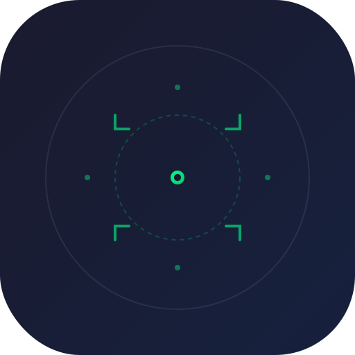

# Front Sight (准星助手)

<div align="center">



**基于 uni-app 的跨平台游戏准星助手应用**

提供多种可自定义的准星样式，支持 H5、小程序及 App 平台，其中 Android App 支持系统级悬浮窗功能。

[](LICENSE)
[](https://uniapp.dcloud.net.cn/)
[](https://vuejs.org/)
[](https://www.typescriptlang.org/)

</div>

---

## 目录

- [特性](#特性)
- [技术栈](#技术栈)
- [支持平台](#支持平台)
- [快速开始](#快速开始)
- [项目结构](#项目结构)
- [核心架构](#核心架构)
- [开发指南](#开发指南)
- [内部工具](#内部工具)
- [API 文档](#api-文档)
- [常见问题](#常见问题)
- [贡献指南](#贡献指南)

---

## 特性

- 🎯 **6 种准星类型**: 十字准星、战术准星、圆形准星、方括号准星、V 形准星、单点准星
- 🎨 **完全自定义**: 支持颜色、大小、粗细、透明度、中心点开关等参数调节
- 🪟 **系统级悬浮窗**: Android 平台支持在任意应用上层显示准星
- 📱 **跨平台支持**: H5、微信小程序、支付宝小程序、Android/iOS App 等多平台
- ⚡ **实时预览**: 设置页面实时显示准星效果
- 💾 **本地存储**: 配置自动保存，应用重启不丢失
- 🌓 **双主题支持**: 支持深色/浅色主题切换

---

## 技术栈

| 类别 | 技术 |
|------|------|
| 框架 | [uni-app 3.x](https://uniapp.dcloud.net.cn/) |
| 语言 | Vue 3 Composition API + TypeScript |
| 构建工具 | Vite 5.x |
| 原生插件 | UTS (UniApp TypeScript) + Java |
| 类型检查 | vue-tsc |

---

## 支持平台

| 平台 | 渲染方式 | 悬浮窗 | 状态 |
|------|----------|--------|------|
| H5 | SVG | ❌ | ✅ 完全支持 |
| 微信小程序 | Canvas | ❌ | ✅ 完全支持 |
| 支付宝小程序 | Canvas | ❌ | ✅ 完全支持 |
| Android App | Canvas + 原生悬浮窗 | ✅ | ✅ 完全支持 |
| iOS App | Canvas | ❌ | ⚠️ 部分支持 |
| HarmonyOS | Canvas | ❌ | 🚧 开发中 |

---

## 快速开始

### 环境要求

- **Node.js**: >= 16.0.0
- **npm**: >= 7.0.0 (或 pnpm/yarn)
- **HBuilderX**: >= 3.8.0 (用于 App 开发和打包)

### 安装依赖

```bash
npm install
# 或
pnpm install
# 或
yarn install
```

### 开发运行

```bash
# H5 开发
npm run dev:h5

# 微信小程序开发
npm run dev:mp-weixin

# 支付宝小程序开发
npm run dev:mp-alipay

# Android App 开发 (需要 HBuilderX)
npm run dev:app
```

### 生产构建

```bash
# H5 构建
npm run build:h5

# 微信小程序构建
npm run build:mp-weixin

# 其他平台请查看 package.json 中的 scripts
```

### 类型检查

```bash
npm run type-check
```

---

## 项目结构

```
front-sight/
├── src/
│   ├── components/
│   │   └── SightRenderer.vue    # 准星渲染组件（核心）
│   ├── pages/
│   │   ├── index/               # 主页（准星显示/隐藏、悬浮窗控制）
│   │   └── settings/            # 设置页（准星样式、颜色、参数调节）
│   ├── types/
│   │   └── sight.ts             # 准星类型定义和预设配置
│   ├── utils/
│   │   └── sightOverlay.ts      # 悬浮窗工具类（封装 UTS 插件）
│   ├── static/
│   │   ├── logo*.svg            # Logo 矢量图标
│   │   ├── icons/               # 生成的 PNG 图标
│   │   └── android/             # Android 启动图标
│   ├── manifest.json            # 应用配置（权限、平台配置）
│   ├── pages.json               # 页面路由配置
│   ├── App.vue                  # 应用入口组件
│   └── main.ts                  # 应用入口文件
├── uni_modules/
│   └── sight-overlay/           # UTS 原生插件
│       └── utssdk/
│           └── app-android/
│               └── index.uts    # Android 悬浮窗原生实现
├── java/
│   └── com/sight/front/
│       └── sight_overlay.java   # Java 原生悬浮窗实现
├── scripts/
│   ├── generate-icons.js        # 图标生成工具
│   ├── convert-splash.js        # 启动页转换工具
│   └── README.md                # 工具说明文档
├── public/                      # 静态资源
├── package.json                 # 项目配置
├── tsconfig.json                # TypeScript 配置
├── vite.config.ts               # Vite 配置
└── README.md                    # 项目文档
```

---

## 核心架构

### 双渲染模式

应用采用条件编译实现不同平台的准星渲染：

```
┌─────────────────────────────────────────────────────────┐
│                    SightRenderer.vue                     │
│  ┌───────────────────────┬─────────────────────────┐   │
│  │    #ifdef H5          │    #ifndef H5          │   │
│  │    SVG 渲染           │    Canvas 渲染         │   │
│  │    高质量矢量图形     │    高性能位图渲染      │   │
│  └───────────────────────┴─────────────────────────┘   │
└─────────────────────────────────────────────────────────┘
```

### 悬浮窗三层架构

```
┌─────────────────────────────────────────────────────────┐
│  pages/index/index.vue (主页面)                         │
│  - 悬浮窗模式开关控制                                    │
│  - 权限检查与请求                                        │
└─────────────────────────┬───────────────────────────────┘
                          │
                          │ uni.$emit / uni.$on
                          │
┌─────────────────────────▼───────────────────────────────┐
│  utils/sightOverlay.ts (JS/TS 封装层)                   │
│  - 单例管理器                                            │
│  - 插件模块加载                                          │
│  - 参数转换                                              │
└─────────────────────────┬───────────────────────────────┘
                          │
                          │ require / import
                          │
┌─────────────────────────▼───────────────────────────────┐
│  uni_modules/sight-overlay/uts (原生层)                 │
│  - Android WindowManager API                            │
│  - 自定义 View 绘制                                      │
│  - 权限处理                                              │
└─────────────────────────────────────────────────────────┘
```

### 数据流

```
设置页 (settings.vue)
        │
        │ uni.setStorageSync('sight_settings', config)
        ▼
    本地存储
        │
        │ uni.getStorageSync('sight_settings')
        ▼
主页 (index.vue)
        │
        │ uni.$emit('sightConfigChanged', config)
        ▼
sightOverlayManager.update(config)
        │
        ▼
  Android 悬浮窗更新
```

---

## 开发指南

### 修改准星样式

准星绘制逻辑位于两个位置，修改时需同步：

1. **前端渲染**: [SightRenderer.vue](src/components/SightRenderer.vue)
   - `drawCross()`, `drawTactical()`, `drawCircle()` 等方法

2. **悬浮窗渲染**: [sight_overlay.java](java/com/sight/front/sight_overlay.java)
   - `OverlayView.onDraw()` 方法

### 添加新的准星类型

1. 更新 [types/sight.ts](src/types/sight.ts) 中的 `SightType` 类型
2. 在 `SightRenderer.vue` 中添加对应的绘制函数
3. 在 `sight_overlay.java` 的 `onDraw()` 中添加原生绘制逻辑
4. 在 [types/sight.ts](src/types/sight.ts) 的 `PRESET_SIGHTS` 中添加预设

### UTS 插件调试

- **日志查看**: HBuilderX 控制台 → 运行日志
- **插件加载失败**: 检查 [manifest.json](src/manifest.json) 中 `nativePlugins` 配置
- **权限问题**: Android 设置 → 应用管理 → 准星助手 → 悬浮窗权限

### 条件编译标记

项目大量使用 uni-app 条件编译：

| 标记 | 说明 |
|------|------|
| `#ifdef APP-PLUS` | 仅在 App 平台编译 |
| `#ifndef APP-PLUS` | 在非 App 平台编译 |
| `#ifdef H5` | 仅在 H5 端编译 |
| `#ifndef H5` | 在非 H5 端编译 |

---

## 内部工具

### 图标生成工具

自动从 SVG 源文件生成各种尺寸的 PNG 图标。

#### 使用方法

```bash
# 使用 Node.js (推荐)
node scripts/generate-icons.js

# 使用 Bash (macOS/Linux)
bash scripts/generate-icons.sh

# 使用 Windows 批处理
scripts\generate-icons.bat
```

#### 生成的图标

| 尺寸 | 文件 | 用途 |
|------|------|------|
| 512x512 | logo-512x512.png | App Store / Google Play |
| 192x192 | logo-192x192.png | Android xxxhdpi |
| 144x144 | logo-144x144.png | Android xxhdpi |
| 96x96 | logo-96x96.png | Android xhdpi |
| 72x72 | logo-72x72.png | Android hdpi |
| 48x48 | logo-48x48.png | Android mdpi |

详细文档请参考: [scripts/README.md](scripts/README.md)

### 启动页转换工具

将 SVG 启动页转换为 PNG 格式。

```bash
npm run splash:png
```

详细文档请参考: [src/static/LOGO_README.md](src/static/LOGO_README.md)

---

## API 文档

### SightConfig

准星配置接口定义。

```typescript
interface SightConfig {
  type: SightType;      // 准星类型
  color: string;        // 十六进制颜色 (如 "#00FF00")
  size: number;         // 大小 (px)
  thickness: number;    // 粗细 (px)
  showDot: boolean;     // 是否显示中心点
  opacity: number;      // 透明度 (0-1)
}
```

### SightType

准星类型枚举。

```typescript
type SightType =
  | 'cross'      // 十字准星
  | 'tactical'   // 战术准星
  | 'circle'     // 圆形准星
  | 'bracket'    // 方括号准星
  | 'chevron'    // V 形准星
  | 'dot';       // 单点准星
```

### sightOverlayManager

悬浮窗管理器 (仅 App 平台)。

```typescript
// 显示悬浮窗
sightOverlayManager.show(config: SightConfig): Promise<void>

// 隐藏悬浮窗
sightOverlayManager.hide(): Promise<void>

// 更新配置
sightOverlayManager.update(config: SightConfig): Promise<void>

// 检查权限
sightOverlayManager.checkPermission(): Promise<boolean>

// 请求权限
sightOverlayManager.requestPermission(): void
```

---

## 常见问题

### 悬浮窗不显示?

1. 检查是否授予悬浮窗权限
2. 确认是否为 Android 平台
3. 查看控制台日志排查错误

### 小程序打包失败?

检查是否使用了不支持的 API 或插件，移除仅限 App 平台的代码。

### 准星位置不准确?

可能是屏幕密度计算问题，检查 `size` 和 `thickness` 参数。

### 更多问题?

请查看 [java/README.md](java/README.md) 或提交 [Issue](https://github.com/F-howk/front-sight/issues)。

---

## 贡献指南

欢迎提交 Pull Request 或报告问题！

1. Fork 本仓库
2. 创建特性分支 (`git checkout -b feature/AmazingFeature`)
3. 提交更改 (`git commit -m 'feat: 添加某功能'`)
4. 推送到分支 (`git push origin feature/AmazingFeature`)
5. 提交 Pull Request

---

## 许可证

本项目采用 MIT 许可证 - 详见 [LICENSE](LICENSE) 文件。

---

## 链接

- [GitHub 仓库](https://github.com/F-howk/front-sight)
- [问题反馈](https://github.com/F-howk/front-sight/issues)
- [更新日志](CHANGELOG.md)

---

## 设计规范

| 属性 | 值 |
|------|-----|
| 主色调 | #00ff88 (荧光绿) |
| 背景色 | #1a1a2e → #16213e (深蓝渐变) |
| 设计元素 | 十字准星、战术角标记、中心点 |
| 风格 | 现代、专业、科技感 |
